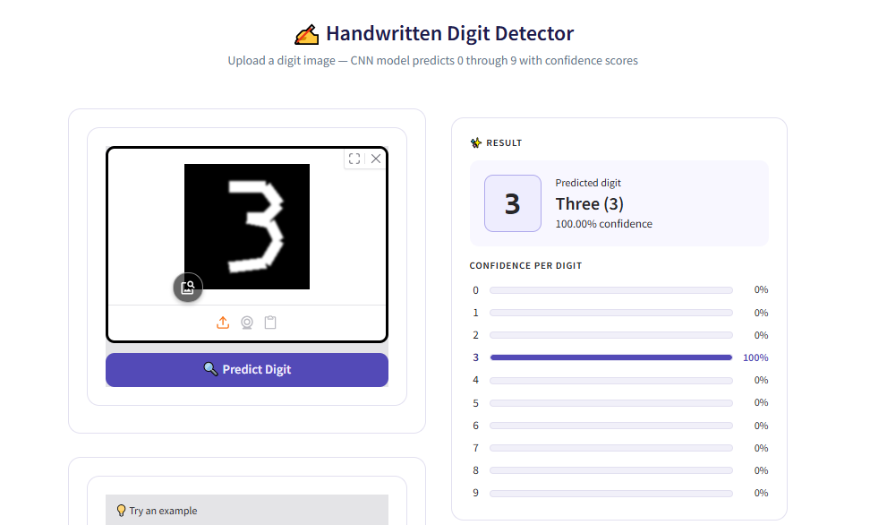
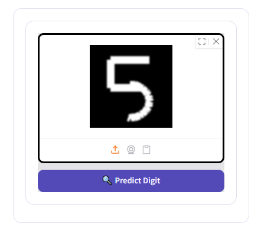
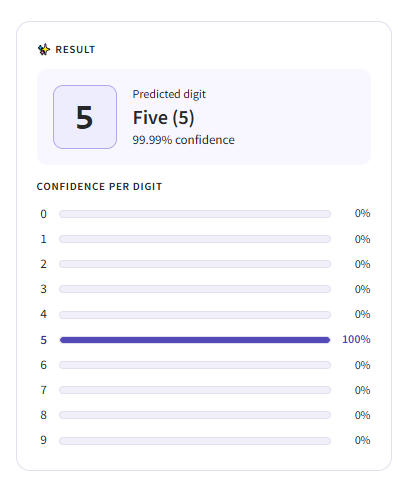

# ✍️ Handwritten Digit Detector

A deep learning web app that detects **handwritten digits (0–9)** from uploaded images using a **CNN trained on the MNIST dataset**, with real-time predictions and confidence scores.

---


---

### 📑 Table of Contents

* [Live Demo](#-live-demo)
* [Screenshots](#-screenshots)
* [Tech Stack](#-tech-stack)
* [Model Architecture & Performance](#-model-architecture--performance)
* [Dataset](#-dataset)
* [Project Structure](#-project-structure)
* [How to Run Locally](#-how-to-run-locally)
* [Contact](#-contact)

---

### 🌐 Live Demo

👉 [Try it on Hugging Face Spaces](https://huggingface.co/spaces/mmuzammilirshad/Hand_Written_Digits_Detector)

---

### 📸 Screenshots

| Upload & Predict | Confidence Results |
|---|---|
|  |  |

---

### 🚀 Tech Stack


---

### 🧠 Model Architecture & Performance

The model is a **Convolutional Neural Network (CNN)** built with Keras/TensorFlow.

| Layer | Details |
|---|---|
| Conv2D × 4 | filters=10, kernel=3×3, activation=ReLU |
| MaxPooling2D × 2 | pool_size=2×2 |
| Flatten | — |
| Dense (output) | 10 units, activation=Softmax |

| Metric | Value |
|---|---|
| Dataset | MNIST |
| Training Samples | 60,000 |
| Test Samples | 10,000 |
| Epochs | 5 |
| Test Accuracy | ~98% |

---

### 📊 Dataset

**MNIST** (Modified National Institute of Standards and Technology) is the benchmark dataset for handwritten digit recognition.

| Property | Details |
|---|---|
| Total Images | 70,000 grayscale images |
| Training Set | 60,000 images |
| Test Set | 10,000 images |
| Image Size | 28 × 28 pixels |
| Classes | 10 (digits 0–9) |
| Format | White digit on black background |

> The dataset is loaded directly via `tensorflow.keras.datasets.mnist` — no manual download required.

---

### 📂 Project Structure

```
Hand_Written_Digits_Detector/
│
├── app.py                        # Gradio UI + inference logic
├── requirements.txt              # Pinned dependencies
├── README.md                     # Hugging Face Space config
│
├── saved_model/                  # TensorFlow SavedModel
│   ├── saved_model.pb
│   ├── fingerprint.pb
│   └── variables/
│       ├── variables.index
│       └── variables.data-00000-of-00001
│
├── samples/                      # MNIST-style example images
│   ├── 0.png
│   ├── 1.png
│   ├── 3.png
│   ├── 5.png
│   ├── 7.png
│   └── 9.png
│
├── screenshots/                  # README screenshots
│   ├── banner.png
│   ├── upload.png
│   └── result.png
│
└── Hand_Written_Digits_Dataset.ipynb   # Training notebook
```

---

### ⚙️ How to Run Locally

1. Clone the repository
   ```bash
   git clone https://github.com/Muzammil-ML-Projects/Hand_Written_Digits_Detector.git
   cd Hand_Written_Digits_Detector
   ```

2. Install dependencies
   ```bash
   pip install -r requirements.txt
   ```

3. Run the app
   ```bash
   python app.py
   ```

4. Open in browser
   ```
   http://localhost:7860
   ```

> **Note:** Make sure the `saved_model/` folder is present in the root directory before running.

---

### 📬 Contact

[](mailto:cornerofcodes00@gmail.com)
[](https://www.linkedin.com/in/muhammad-muzammil-irshad-05b863333)
[](https://github.com/Muzammil-ML-Projects)
[](https://www.kaggle.com/)

---

<p align="center">Made with ❤️ by <strong>Muhammad Muzammil Irshad</strong></p>
